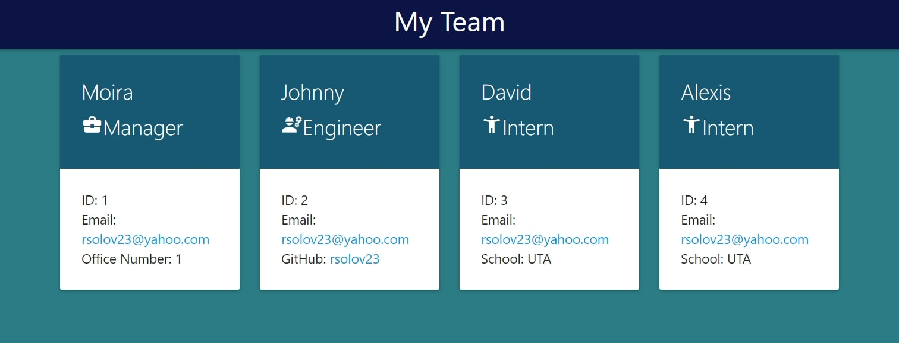
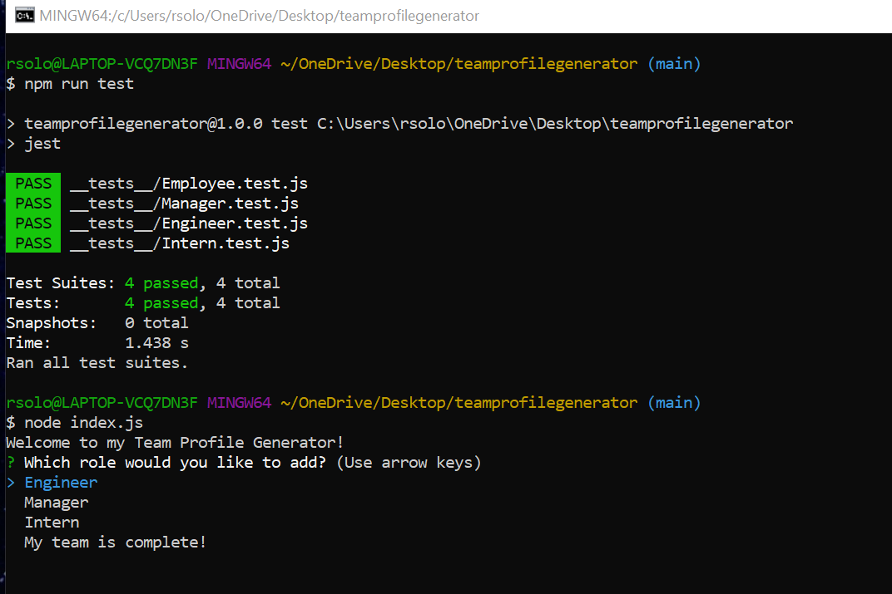

# Rachel's Team Profile Generator

## Table of Contents

- [Description](#description)
- [Instructions](#instructions)
- [Screentastify Link](#screentastify-link)
- [Usage](#usage)
- [Github Profile](#github-profile)
- [Link to Team Profile Generator](#team-profile-generator)
- [Contribution](#contribution)
- [License](#license)

### **Description**

This Team Profile Generator will quickly assemble your team by following these instructions

### **Instructions**

1. Clone my repo
2. Open your terminal in the file
3. Enter node index.js in the command line
4. Complete the prompted questions and you will then have a fantastic Team Profile

### **Screentastify Link**

- https://drive.google.com/file/d/16S4r8hXqAstmiuN3UKu2c7V_d9aKxfEa/view

### Usage

### **Github Profile**

https://github.com/rsolov23

### **Link to my README Generator**

- https://rsolov23.github.io/Rachel-s-Team-Profile-Generator/
- https://github.com/rsolov23/Rachel-s-Team-Profile-Generator

### **Contribution**

I worked with Nathaneal White on this challenge.

- https://github.com/NathanaelWhite/OOP-Team-Profile-Generator

Feel free to contribute to this project in any of the following ways:

- [Submit bug and feature requests](https://github.com/rsolov23/Rachel-s-Professional-README-Generator/issues)
- [Review Source Code Changes](https://github.com/rsolov23/Rachel-s-Team-Profile-Generator/pulls) and make pull requests from typos to content

### **License**

Licensed under the [MIT License](https://github.com/rsolov23/Rachel-s-Team-Profile-Generator/blob/main/License.txt)

Copyright (c) 2021 Rachel Solov
